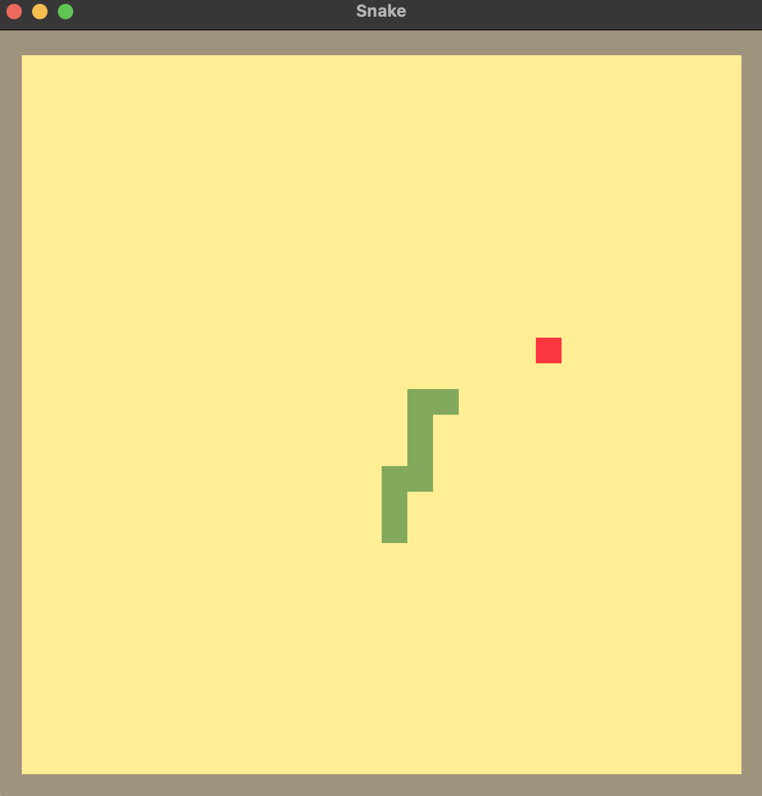

# Rust-Snake

A simple implmentation of Snake in Rust, with Piston Game Engine (using the piston_window convenience wrapper)

I built this game as a part of the Tensor Programming Rust course on Youtube, which I highly recommend if you are learning Rust



<span style="display:block;text-align:center">![Screenshot]assets/images/Snake.png)</span>

```
# Play game
cargo run

# Build binary
cargo build --release
```
